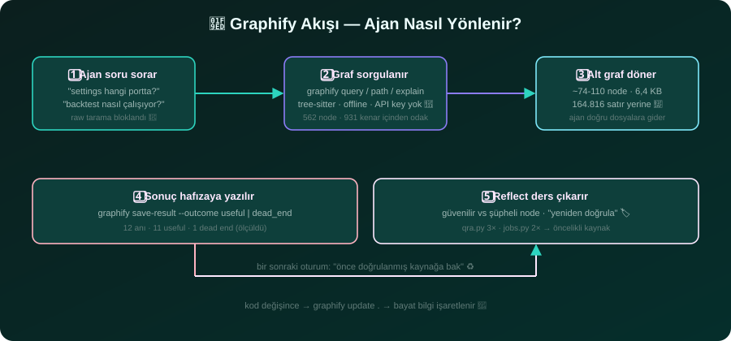

# 🧠 graphify-in-action

**A measured case study: 97.6% fewer tokens by querying a knowledge graph instead of re-reading 7,580 lines of code.**

> Every number here was measured on a real project (2026-08-16, `graphify 0.9.43`). No estimates, no marketing — just data. 🧪

**Read this in other languages:** 🇹🇷 [Türkçe](README.tr.md)



---

## 🌐 What is graphify?

graphify reads your code and draws a **map** of it — showing which files call, depend on, or affect each other. Instead of reading files one by one (like walking every street), your AI assistant just looks at the map and goes straight to what matters.


*The FastAPI codebase mapped by graphify — every node is a concept, colors are communities. (Image: graphify, Apache-2.0)*

- **A map, not a pile of files.** It pre-draws "who calls whom," so relationships are already there — the agent doesn't re-derive them every time.
- **Read the map, not every street.** One query returns a small, relevant slice (~1.7K tokens) instead of re-reading the whole codebase (~71.8K tokens).
- **Local, free, offline.** Built on your machine with **0 API calls** — no keys, no data leaving your computer.



*`graphify path "FastAPI" "ModelField"` — each hop is a call/import edge, so "who calls whom" is answered directly. (Image: graphify, Apache-2.0)*

graphify is open-source ([Graphify-Labs/graphify](https://github.com/Graphify-Labs/graphify), 100k+ ★, YC) and works in **20+ assistants** (Claude Code, Cursor, Codex, Gemini CLI, GitHub Copilot, OpenCode, Aider, …).

> 📦 Official package: `graphifyy` on PyPI (CLI: `graphify`) · https://graphify.com · This repo is an **independent case study**, not affiliated with graphify.

## TL;DR

- On a 67-file / 7,580-line / 71,802-token codebase, one `graphify query` returned a **1,694-token** subgraph — **97.6% less** context.
- Extraction is **100% deterministic** (tree-sitter AST, no LLM) — **0 API calls**, fully offline.
- The graph also **learns**: 12 saved queries → 11 useful, 1 dead-end flagged so it is never repeated.

## 🚀 Measured impact (2026-08-16, graphify 0.9.43)

| Metric | Value | Meaning |
|---|---|---|
| 📉 **Token reduction** | **97.6%** | Code 71,802 tokens → single query **1,694 tokens** (cl100k_base) |
| ✅ **Extraction quality** | **100% extracted · 0% ambiguous** | 4/931 edges inferred (0.4%) — deterministic, no LLM |
| 💸 **Cost** | **0 API calls · $0** | tree-sitter local parse, fully offline |
| 🗺️ **Graph size** | **562 nodes · 931 edges · 44 communities · 599 KB** | The whole code map in one file |
| 🧠 **Memory** | **12 queries → 11 useful · 1 dead-end** | The system learns, dead-ends aren't re-scanned |
| ⏱️ **Answer time** | **~2 min** | Agent reaches the right files via a scoped query |

## 🎯 "Install it, but only if it helps" — answered with data

The install criterion was: *"if graphify doesn't help, or worsens token/context usage, don't install it."* Here is the measured answer:

| Criterion | Measurement | Result |
|---|---|---|
| 💨 **Efficiency** | 71,802 tokens of code → **1,694 tokens** per query | **97.6% fewer tokens** |
| 🎯 **Error-free** | **100% extracted · 0% ambiguous**; inferred edges 0.4% (confidence 0.8) | Deterministic — no LLM, no hallucination source |
| 💸 **Cost** | **0 API calls**, no API key required for code | Fully offline |
| 🧠 **Learning** | 12 saved queries: **11 useful**, 1 dead-end flagged | Dead-ends aren't re-scanned |

### 🔬 vs pasting the whole codebase (freetext)

| | Pasting the whole code | A graphify query |
|---|---|---|
| **Tokens** | **71,802 tokens** — fits a 128K window but leaves no room for instructions/analysis; `graph.json` at **167,202 tokens** does not fit at all | **1,694 tokens** — fits **~75×** in the same window |
| **Relationships** | None — the agent must derive "who calls whom" from scratch every time | **931 edges** pre-computed, delivered by the query |
| **Latency / drift** | Slows down in large contexts, can drift to the wrong file | Focused subgraph → the right file, in seconds |

## 📂 What's in this repo

| | English | Türkçe |
|---|---|---|
| 📊 All measurements + real flows | [docs/en/02-real-impact.md](docs/en/02-real-impact.md) | [docs/tr/02-gercek-etki.md](docs/tr/02-gercek-etki.md) |
| 🔧 Install & daily usage guide | [docs/en/01-installation-guide.md](docs/en/01-installation-guide.md) | [docs/tr/01-kurulum-rehberi.md](docs/tr/01-kurulum-rehberi.md) |
| ⚖️ Neutral comparison vs alternatives | [docs/en/03-comparison.md](docs/en/03-comparison.md) | [docs/tr/03-karsilastirma.md](docs/tr/03-karsilastirma.md) |
| 🎨 Interactive summary page | [Live page (TR/EN toggle)](https://alikula37.github.io/graphify-in-action/) — source: `index.html` |

## 🏅 graphify's own published benchmarks

| Benchmark | Metric | graphify |
|---|---|---|
| LOCOMO (n=300) | recall@10 | **0.497** (mem0 0.048, supermemory 0.149) |
| LongMemEval-S (n=50) | QA accuracy | **76%** (tied with dense RAG) |
| Graph build | LLM credits | **0** |

*Source: [graphify BENCHMARKS.md](https://github.com/Graphify-Labs/graphify/blob/v8/BENCHMARKS.md)*

## 🚀 Get started (30 seconds)

```bash
uv tool install graphifyy        # or: pipx install graphifyy
graphify install --project --strict
```

Then, in your AI assistant, run `/graphify .` — you get three files (`graph.html`, `GRAPH_REPORT.md`, `graph.json`).

For a **one-step AI-agent install prompt** (with the "install only if it helps" decision criterion baked in), see the [installation guide](docs/en/01-installation-guide.md).

---

*Source project: [Critic Forecast](https://github.com/alikula37/critic-forecast) — a multi-model financial forecasting platform (private). Measured with graphify 0.9.43 (current at time of writing: 0.9.45).*
