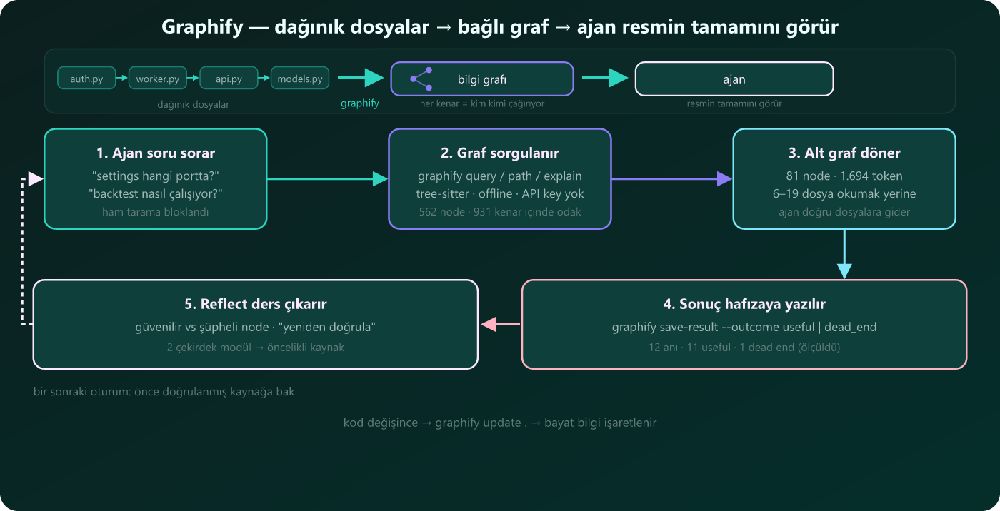
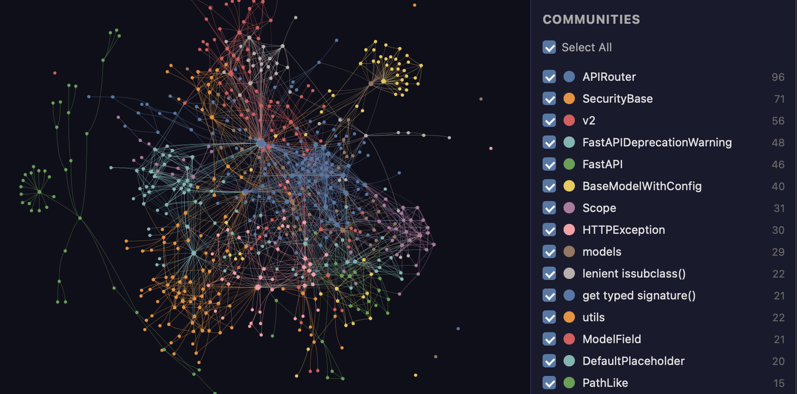
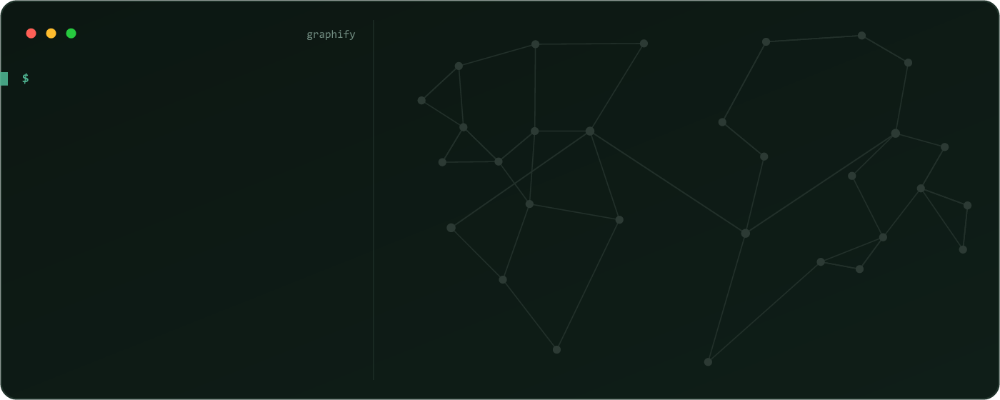

# 🧠 graphify-in-action

**Ölçülmüş bir vaka çalışması: bir soruyu yanıtlamak için %82–90 daha az bağlam — ilgili kaynak dosyaları yeniden okumak yerine bir bilgi grafını sorgulayarak.**

> Buradaki her rakam gerçek bir projede ölçüldü (2026-08-16, `graphify 0.9.43`). Tahmin yok, pazarlama yok — sadece veri. 🧪

**Diğer dillerde oku:** 🇺🇸 [English](README.md)



---

## 🌐 graphify nedir?

graphify kodunuzu okur ve **haritasını** çıkarır — hangi dosyanın hangisini çağırdığını, ona bağlı olduğunu veya etkilediğini gösterir. Dosyaları tek tek okumak yerine (sokak sokak gezmek gibi), AI asistanınız haritaya bakar ve doğrudan işine yarayana gider.



*graphify ile haritalanmış FastAPI kod tabanı — her düğüm bir kavram, renkler topluluklar. (Görsel: graphify, Apache-2.0)*

- **Bir dosya yığını değil, bir harita.** "Kim kimi çağırıyor"u önceden çizer; ilişkiler hazırdır — ajan her seferinde sıfırdan çıkarmaz.
- **Haritaya bak, her sokağı gezme.** Tek sorgu, ajanın grafsız grep'leyip okuyacağı dosyaları (~9,6K–16,8K token) yeniden okumak yerine küçük ve ilgili bir dilim (**1.694 token**) döndürür.
- **Yerel, ücretsiz, offline.** Makinenizde **0 API çağrısıyla** kurulur — anahtar yok, veriniz bilgisayarınızdan çıkmaz.



*`graphify path "FastAPI" "ModelField"` — her adım bir çağrı/import kenarı, yani "kim kimi çağırıyor" doğrudan cevaplanır. (Görsel: graphify, Apache-2.0)*

graphify açık kaynaktır ([Graphify-Labs/graphify](https://github.com/Graphify-Labs/graphify), 100k+ ★, YC) ve **20+ asistanı** destekler (Claude Code, Cursor, Codex, Gemini CLI, GitHub Copilot, OpenCode, Aider, …).

> 📦 Resmi paket: PyPI'de `graphifyy` (CLI: `graphify`) · https://graphify.com · Bu repo **bağımsız bir vaka çalışmasıdır**, graphify ile bağlantılı değildir.

## TL;DR

- Tek bir `graphify query` **1.694 token'lık** ilişki haritası döndürdü. Aynı soruyu graphify olmadan yanıtlamak, ilgili dosyaları grep'leyip okumak demek — **9.636–16.842 token** (5,7×–10× daha fazla).
- Ekstraksiyon **%100 deterministik** (tree-sitter AST, LLM yok) — **0 API çağrısı**, tamamen offline.
- Graf ayrıca **öğrenir**: 12 kayıtlı sorgu → 11'i işe yaradı, 1 çıkmaz işaretlendi ve bir daha tekrarlanmıyor.

## 🚀 Ölçülen etki (2026-08-16, graphify 0.9.43)

| Metrik | Değer | Anlamı |
|---|---|---|
| 📉 **Bağlam azalması** | **%82–90** | Aynı soru: **1.694 token** (graphify) vs **9.636–16.842 token** (ajanın grafsız okuyacağı dosyalar) |
| ✅ **Ekstraksiyon kalitesi** | **%100 extracted · %0 ambiguous** | 931 kenarın 4'ü çıkarımsal (%0,4) — deterministik, LLM yok |
| 💸 **Maliyet** | **0 API çağrısı · 0 ₺** | tree-sitter yerel parse, tamamen offline |
| 🗺️ **Graf boyutu** | **562 node · 931 kenar · 44 topluluk · 599 KB** | Tüm kod haritası tek dosyada |
| 🧠 **Bellek** | **12 sorgu → 11 useful · 1 dead-end** | Sistem öğrenir, çıkmazlar tekrar taranmaz |
| ⏱️ **Cevap süresi** | **~2 dk** | Ajan, odaklı sorguyla doğru dosyalara ulaşır |

## 🎯 "Kur, ama sadece işe yararsa" — veriyle cevabı

Kurulum kriteri şuydu: *"graphify işe yaramazsa ya da token/context kullanımını kötüleştirirse kurma."* İşte ölçülmüş cevap:

| Kriter | Ölçüm | Sonuç |
|---|---|---|
| 💨 **Verimlilik** | 9.636–16.842 token (ajanın grafsız okuyacağı dosyalar) → sorgu başına **1.694 token** | **%82–90 daha az bağlam** |
| 🎯 **Hatasız çalışma** | **%100 extracted · %0 ambiguous**; çıkarımsal kenar %0,4 (güven 0,8) | Deterministik — LLM yok, halüsinasyon kaynağı yok |
| 💸 **Maliyet** | **0 API çağrısı**, kod için API key gerekmez | Tamamen offline |
| 🧠 **Öğrenme** | 12 kayıtlı sorgu: **11 useful**, 1 çıkmaz işaretli | Çıkmazlar tekrar taranmaz |

### 🔬 vs aynı soruyu graphify olmadan yanıtlamak

| | Graphify olmadan (grep + oku) | Graphify sorgusu |
|---|---|---|
| **Bağlam** | **9.636–16.842 token** — ajan ilişkileri çıkarmak için ilgili kaynak dosyaları grep'ler ve okur | **1.694 token** — ilişkiler önceden hesaplı, odaklı alt graf olarak gelir |
| **İlişki bilgisi** | Her oturumda dosya okuyarak sıfırdan çıkarılır | **931 kenar** önceden hesaplı, sorguyla hazır gelir |
| **Gecikme / sapma** | Büyük bağlamda yavaşlar, yanlış dosyaya kayabilir | Odaklı alt graf → doğru dosya, saniyeler |

## 📂 Bu repoda ne var?

| | English | Türkçe |
|---|---|---|
| 📊 Tüm ölçümler + gerçek akışlar | [docs/en/02-real-impact.md](docs/en/02-real-impact.md) | [docs/tr/02-gercek-etki.md](docs/tr/02-gercek-etki.md) |
| 🔧 Kurulum & günlük kullanım rehberi | [docs/en/01-installation-guide.md](docs/en/01-installation-guide.md) | [docs/tr/01-kurulum-rehberi.md](docs/tr/01-kurulum-rehberi.md) |
| ⚖️ Muadillerle tarafsız karşılaştırma | [docs/en/03-comparison.md](docs/en/03-comparison.md) | [docs/tr/03-karsilastirma.md](docs/tr/03-karsilastirma.md) |
| 🎨 Etkileşimli özet sayfa | [Canlı sayfa (TR/EN düğmesi)](https://alikula37.github.io/graphify-in-action/) — kaynak: `index.html` |

## 🏅 graphify'nin kendi yayınladığı benchmark'lar

| Benchmark | Metrik | graphify |
|---|---|---|
| LOCOMO (n=300) | recall@10 | **0.497** (mem0 0.048, supermemory 0.149) |
| LongMemEval-S (n=50) | QA doğruluğu | **%76** (dense RAG ile eşit) |
| Graf oluşturma | LLM kredisi | **0** |

*Kaynak: [graphify BENCHMARKS.md](https://github.com/Graphify-Labs/graphify/blob/v8/BENCHMARKS.md)*

## 🚀 Başla (30 saniye)

```bash
uv tool install graphifyy        # veya: pipx install graphifyy
graphify install --project --strict
```

Ardından AI asistanında `/graphify .` çalıştır — üç dosya alırsın (`graph.html`, `GRAPH_REPORT.md`, `graph.json`).

"İşe yararsa kur" kriteri gömülü **tek adımlık AI-ajan kurulum promptu** için [kurulum rehberine](docs/tr/01-kurulum-rehberi.md) bak.

---

*Kaynak proje: çok modelli finansal tahminleme platformu (private repo, burada linklenmemiştir). graphify 0.9.43 ile ölçüldü (yazım anında güncel: 0.9.45).*
